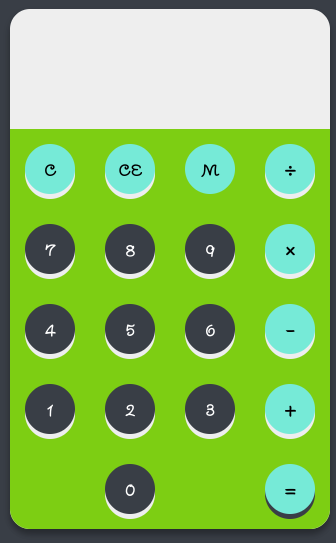
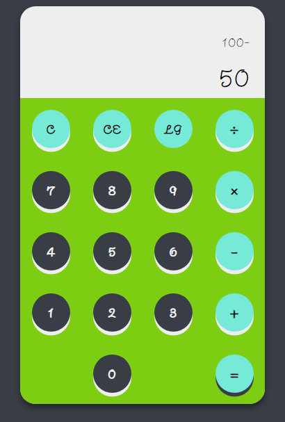
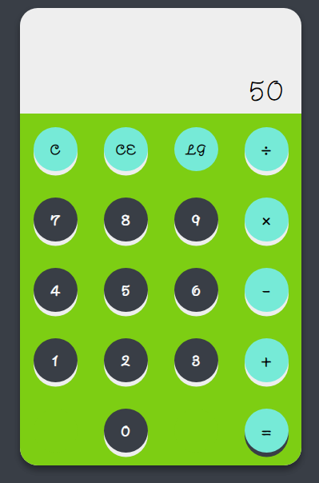

# Web-Calculator
## Technologies Used:
  - HTML.
  - CSS.
  - Javascript.
## Mathematical Operations:
  - Addition.
  - Subtraction.
  - Multiplication.
  - Divided.
## Calculator Image:

## Example Operation: (Subtraction)
 
## Deploy:
